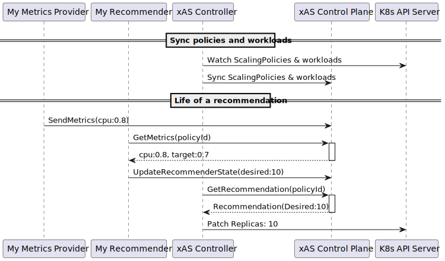

# xAS Architecture

xAS is a decoupled, model-based autoscaling system for Kubernetes. It separates
*Metric Collection*, *Decision Making*, and *Actuation* to support advanced
scaling strategies beyond standard `HorizontalPodAutoscaler` (HPA) and
`VerticalPodAutoscaler` (VPA).

## How It Works

xAS uses a *Recommender-Driven Architecture*. Instead of hardcoded logic, you
configure *Metric Providers* (reading metrics from configurable sources), and
*Recommenders* (turning those metrics into scaling recommendations). The final
number of replicas the scaling target is scaled to is given by the recommender
with the highest recommendation.

### The Decision Loop

1.  *Collect:* Providers scrape metrics (via Plugins) and push them to the
    *Control Plane*.
2.  *Recommend:* The *Recommender Engine* polls the *Control Plane*, calculates
    desired replicas based on your policy, and pushes a *Decision*.
3.  *Aggregate:* The Control Plane aggregates all decisions:
    *   *Activation Phase:* Checks if *any* recommender says "Active". If not,
        scales to 0.
    *   *Scaling Phase:* Takes the *maximum* replicas requested by any active
        recommender.
4.  *Actuate:* The Controller updates your Deployment.

## Building Blocks

The xAS prototype has four main components:

1.  *xAS Control Plane*: Keeps track of autoscaling signals, policies and
    recommendations. All other components connect to it: there are no networking
    requirements for it to connect to any other in-cluster component.

    This is in contrast with the standard Kubernetes HPA controller which
    connects to (e.g.) Metrics Server in user nodes, often requiring network
    tunnels to be set up using
    [Konnectivity](https://kubernetes.io/docs/tasks/extend-kubernetes/setup-konnectivity/).

2.  *xAS Controller*: Connects to the Kubernetes API server to watch for
    `ScalingPolicy` CRDs and for scaling target state (e.g., the number of ready
    Pods under the target). Syncs them to the Control Plane.

    Updates ScalingPolicy `status` field with updates from xAS control plane,
    and actuates scaling targets with the latest recommended number of replicas.

3.  *Metric provider*: Either a custom provider implemented by a third-party, or
    one of the core metric providers. Reads metrics and regularly pushes them to
    the Control Plane.

4.  *Recommender*: Either a custom recommender implemented by a third-party, or
    one of the core recommenders. Responsible for reading scaling policies and
    metrics, and pushing scaling recommendations, to the Control Plane.

    Note that using bidirectional gRPC streams would allow the Control Plane to
    push metric updates to the recommender while preserving the requirement that
    recommenders have no network connectivity to user workloads.

